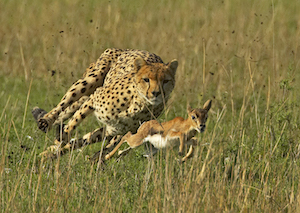

# A Life In Chains
The road to freedom has been a challenge to say the least.

Somewhere along the way my dreams, passions, and goals, and persons of influence talked me into going to college. I'll save that story for another time. I started my path first with a semester of private 4-year college followed by 2 years of community college.  What ended up happening is during my studies, my scholarships and grants ran out and I found myself reaching for student loans to answer the void to my higher education. It started out small, but I never seemed to make any progress with paying off more than the interest on the loans. Fast forward a few years and I returned to the college scene in hot pursuit of upgrading my A.A.S. in Computer Networks & Security to a B.S. in either Computer Science or Management Information Systems. The initial paperwork for my admission indicated I would have a nearly fully covered tuition. After reviewing the materials with my campus financial counselor, we noticed a box had been checked that would drastically increase my responsibilities for tuition payment. Again, already being beyond the point of no return, I reached for student loans.  

These loans along with a few other debts would turn into one of the biggest hurdles I have faced as of yet. These debts started as small chains around my ankles and ended up turning into figurative shackles. Debt is sneaky and slowly creeps into every corner of your life. It challenges your finances which in turn affects every aspect of your life including emotions, stress levels, opportunities, travel, etc. The monthly repayment notices start feeling like a pet, like they just won't go away.

{: .pull-right}

# Getting Gazelle Intense
You have to face them head on.

Your debts are cheetahs that are looking for lunch. They want to eat up your focus, your income, your life. You have to bust it. You have to get gazelle intense and RUN FOR YOUR LIFE!

My wife and I stuck to a written budget and, after graduation, sent nearly 1/3rd of our household income to our "debt snowball". Every dollar we could squeeze out of our expenses was saved and sent towards paying off the debt that had piled up.

<figure>
	
	<figcaption><a href="http://blueatoll.com/" title="Gazelle vs Cheetah">Gazelle vs Cheetah</a>.</figcaption>
</figure>

# Financial Peace
Financial peace can be summed up into one word : Freedom.

On October 1, 2015 we wrote a check to pay off the balance in full of our last debt owed.
Thus freeing us from the chains of bondage of debt, forever changing our family tree, and setting us on the path to true financial peace and freedom.

# The Key
The key to getting out of debt (in Suzi’s words):
	-Being willing to sacrifice. Not just not buying things, but Jim’s incredible work sacrifice. Working extra side jobs, working long hours. The air conditioning in the truck was broken and we decided to not get it fixed (for the entire year), and Iowa summers are pretty humid!

# To Be Continued...
usual questions:
	-Where are you from?
	-What do you do?
	-How much have you paid off?
	-How long did it take you?
	-How much do you make?
	-What jobs do you have?
	-What kind of debt was this?
	-What’s the key to getting out of debt?
	-How did this journey get started?
	-Whats the hardest thing you have done in the last however many months?
