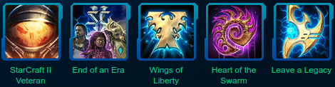

# Saga &#58;
My StarCraft Saga (Campaign) Comes To A Close

1. StarCraft (1998)

2. StarCraft: Brood War (1999)

3. Wings of Liberty (8/23/2010)

4. Heart of the Swarm (8/26/2015)

5. Legacy of the Void (4/22/2018)

6.  Nova Covert Ops (To Be Continued...)

7. Multiplayer (To Be Continued...)

8. StarCraft Remastered (To Be Continued...)

# Sunday April 22, 2018

Today...

This day marks the dawn of a new era.
A time when a remarkable journey has come to an end.

Today marks the day when my StarCraft + StarCraft2 Saga comes to an end.
Twenty years playing StarCraft, today marks the end of the closing chapters.
Today, I completed in entirety the Legacy of the Void campaign.

Marking 8 years from completing Wings of Liberty.
Marking 3 years from completing Heart of the Swarm.
Marking 20 years of StarCraft alongside Blizzard's very own 20th Anniversary Celebration.

---

The emotion is immense. I find myself breathless thinking of what this means.
Something so near and dear to me finally has closure.

Nearing the end... the inevitable being expected... I have avoided it for so very long in hopes of extending the journey to the farthest stretches of the universe.
This epic saga, stretching the far reaches of space, has provided countless hours of enjoyment, stress, laughter, comradery/camaraderie.
This game is responsible for some of my fondest moments with my closest of friends and family.

Today... I have witnessed the end of an era. An era where Terran, Zerg, Protoss fight for their place in the universe. (no spoilers)

Today... I have viewed the last cut-scene... the last movie... the ending credits.

---

Today I commemorate this day as a celebration of unity amongst my fellow players (and viewers) in honor of the memories, in honor of the years spent discovering and experiencing the epic saga known as StarCraft.

I lovingly showcase these achievements awarded to such a right of passage on my player profile and encourage anyone and everyone to pick it up and play.

I implore you to make your own memories as you travel through the Koprulu Sector.

[Play for free!](https://starcraft2.com/en-us/game)

---

Today I finally wrap up a story, a saga, an epic adventure as I look forward to what StarCraft and life have in store for me next.

"Finally." -SC

"Hell, Its about time." -SC2"

"En Taro Roy"

"En Taro Suzi"
